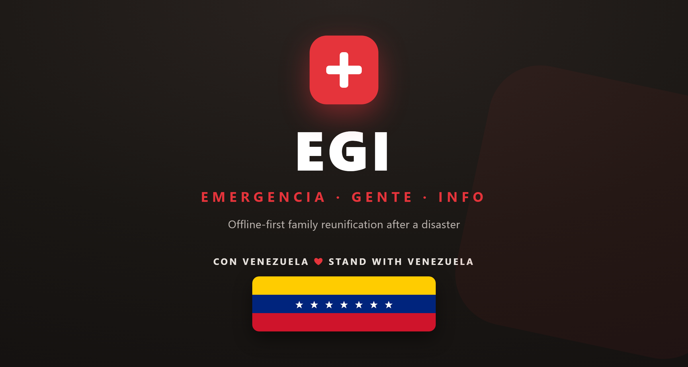

<div align="center">



# EGI

**EMERGENCIA · GENTE · INFO**

An open-source, offline-first, self-hostable system to help families find each
other after a disaster, even when internet access is limited or unstable.

English | [Español](docs/README.es.md) | [Português](docs/README.pt.md)

<br>


[Features](#-features) · [Quick Start](#-quick-start) · [Architecture](#-architecture) · [Roadmap](#-roadmap) · [Docs](#-documentation) · [Contributing](#-contributing)

</div>

---

## 💡 Why I Am Building This

*This is a personal project, so let me tell it the personal way.*

In **December 1999**, Vargas, Venezuela was hit by one of the worst natural
disasters in the country's history. Days of rain turned the mountains into mud
and water, and whole neighborhoods were swept away. I was just a baby then. My
family survived, thank God, but I grew up inside the memory of it. My
grandfather, my great-grandmothers, and pretty much anyone in Vargas old enough
to remember would talk about *el deslave* for years afterward. That tragedy was
part of the air I breathed growing up.

When I was around fourteen or fifteen, I talked a lot with my step-grandfather,
**Capitán Miguel V**, an old firefighter. He taught me about the **1967 Caracas
earthquake** and what he lived through that day. Buildings broken into pieces.
Buildings that dropped like a deck of cards. I saw some of the pictures and tried
to imagine it, and it was awful. My great-grandmother spoke about 1967 too. To
the people who told them, these were not history lessons. They were memories.

And it's still alive. Just two or three months ago I was talking with my
girlfriend's grandmother. She was there in 1967. She's from Chile, but she was
living in Venezuela at the time, and to this day she talks about that day like it
happened yesterday. She grew up with earthquakes in Chile, she was used to them,
and even so she told me she really thought she was not going to make it that day.
That was a 6.6.

In **2010**, the earthquake in Haiti happened. I was thirteen. I remember
collecting and sending things from school to help, even though at that age I
didn't really understand yet what a tragedy was.

Now it is **2026**, and it's happening again, and this time it's close. This one
wasn't a single quake. It was two of them, a 7.5 and a 7.2, plus aftershocks of
magnitude 4 and 5 that keep coming, over and over, even now. We live in the age
of AI, and yet, as a society, we still can't come together to bring some peace
and some help to a country in need when disaster strikes. A member of my own
family is missing, and has not been found. I'm far away, in another country, and
there is nothing I can do from here to dig anyone out of the rubble. So I do the
one thing I actually know how to do. I write code. This project is part of that,
a way to keep my hands busy and my head somewhere other than the worst of it.

Because here is the thing: with all the technology we have, where is the app for
*this*? The big organizations don't have one ready. The big tech companies mostly
haven't thought about it (thank you, Google, for sending earthquake alerts to
some people before the shaking, but the *after* is barely considered). When
disaster hit, the official response was a ChatGPT-style website. That's fine, and
it's easy to stand up, but it's the wrong tool for this. In a real disaster there
is usually **no wifi**. People can't report. People can't stay connected. And
staying connected, being able to **count** people, to know who is alive, is
exactly what matters most.

From a distance, I've done everything I could think of: sharing and re-sharing
posts of missing people, their last known locations, Instagram stories, lists of
buildings going around to see who made it out alive. It works, a little. But it's
chaos. It's screenshots and reposts and spreadsheets, and none of it can move
when the internet is gone.

So I'm building EGI. I'm building it with the best of my own knowledge and the
help of AI, in the **hope that no one ever has to use it**. But if they do, it's
ready to go. If a country needs it, if a community needs it, they can run it on a
server and give people access. My hope is that in moments of tragedy people will
come together to support the server costs, or that organizations will donate a
server, so that this software can stay alive and accessible when it is needed
most.

That's the whole reason this exists.

---

### What it does, in one breath

After a disaster, people need answers fast:

> Is my family member safe?  
> Where were they last seen?  
> Has someone already reported them?  
> Can this information move even when there is no internet?

**EGI** exists to make emergency information about people easier to register,
search, sync, translate, and self-host, especially when connectivity is gone and
phones may only be able to reach each other over Bluetooth.

The name means:

**Emergencia**: built for crisis situations  
**Gente**: centered on people, families, and communities  
**Info**: focused on useful, searchable information

This project started from a Venezuelan context, but it is built for any
community, anywhere, that needs a lightweight way to find its own people.

---

## 🔗 How Does the Mesh Network Work?

In a real disaster there is usually **no wifi**, but most people still have a
phone with Bluetooth in their pocket. The EGI Android app turns those phones into
a **human chain** that can move information without a working internet connection.

It works like this:

- EGI Android phones near each other exchange records over **Bluetooth**, no
  internet required.
- A record hops from phone to phone, person to person, until it reaches a phone
  that *does* have internet. That phone — a **gateway** — uploads everything to
  the EGI cloud. Updates from the cloud flow back **down the same chain** to
  phones that never get online.
- If you stand near someone whose phone has internet (a gateway), your records
  sync to the cloud faster.

```text
        ☁  EGI cloud / server
        ▲
        │  internet
        │
   ┌─────────┐      ┌─────────┐      ┌─────────┐
   │ Phone A │◄─BLE─►│ Phone B │◄─BLE─►│ Phone C │
   │ GATEWAY │      │ offline │      │ offline │
   │ online  │      │         │      │         │
   └─────────┘      └─────────┘      └─────────┘

A record created on Phone C hops C → B → A over Bluetooth.
Phone A (the gateway) then uploads it to the cloud, and any
cloud updates travel back down the chain: A → B → C.
```

This is **store-and-forward**, not a live internet connection. Nothing is
streaming in real time. It works because **people physically move and cluster** —
at a water point, a clinic, a pickup truck handing out supplies — and every phone
they pass carries the data a little further.

### What the mesh can't do (the limits)

- **Android only.** The mesh runs on Android. iOS is not supported because Apple
  restricts background Bluetooth: an iPhone can't advertise or scan for EGI's
  custom record-exchange protocol while the app is in the background, which is
  exactly what a crisis relay needs.
- **Short range.** Bluetooth reaches roughly **10–40 meters**. Two phones have to
  come fairly close for records to jump between them.
- **Not instant.** Every hop adds delay. A record may take minutes or hours to
  reach a gateway, depending on how people move.
- **More battery.** Keeping the mesh on uses more battery than a phone at rest,
  because Bluetooth is constantly listening and relaying.
- **Privacy.** Records travel **device to device** between nearby phones. The
  mesh is opt-in and encrypted, but the gateway flag does reveal that a device
  currently has cloud access. Do not enter information you are not willing to
  share with strangers who may be nearby.

---

## 🎯 Features

### 🧭 Emergency Registry

**Person reports**: register someone as `missing`, `found`, `safe`, or `deceased`

**Local search**: search by name, status, location, notes, or other keywords

**Event context**: designed around a specific disaster or emergency, not a generic database

**Community hosting**: any group can deploy its own server and own its data

### 🐾 Missing Animals (Pets)

In a disaster people don't only lose family — they lose pets. EGI registers
missing and found animals as a **separate, parallel registry**, never mixed with
missing-person reports (so the people registry stays clean and no one files a pet
as a person).

**Animal reports**: register a dog, cat, bird, rabbit, or other pet as `missing`,
`seen`, `found`, `reunited`, `deceased`, or `unknown`, with species, breed, colour,
distinguishing marks, microchip, last-seen location, and a photo.

**Same mesh, separate track**: animal records sync over the same Bluetooth mesh
and cloud `/sync` as people, always tagged `record_type="animal"` so the two are
never confused. Each device can independently opt out of seeing, being notified
about, or relaying animal records.

**Shelter animal board**: a shelter or clinic can list the animals in its care so
owners can find a lost pet.

**Deduplication & safety**: duplicate animal reports (same microchip, or same
owner re-filing the same pet, or look-alike fuzzy matches) are detected and merged
without ever crossing into person records; owner contact info is hidden until a
reveal tap and is rate-limited against bulk scraping.

The app reminds anyone who lands on the animal form: *"¿Buscas a una persona? Usa
el formulario de personas."*

### 📡 Offline First

**Local storage**: the web app saves records on the device first

**Progressive Web App**: works from a browser and can be installed on supported phones

**Sync when online**: records can sync with the server when connectivity returns

**Low-bandwidth design**: built for phones, unstable data, and crisis conditions

### 🔵 Bluetooth Mesh (In Development)

**Android only**: the mesh runs on Android because it offers the background Bluetooth access a crisis relay needs; iOS is not supported (see [How does the mesh network work?](#-how-does-the-mesh-network-work)).

**Bluetooth Low Energy**: functional peer-to-peer sync between nearby phones (GATT index exchange + bloom filter + store-and-forward).

**Store and forward**: phones exchange records offline and upload them when any device gets internet.

**Wi-Fi Direct planned**: bulk transfer for photos and large record batches.

**Protocol draft**: see [`mobile/shared/protocol.md`](mobile/shared/protocol.md).

### 📄 Paper Import With OCR + AI

**Tesseract OCR**: extracts text from photos of lists, flyers, or paper forms.

**Structured extraction with Prompture**: turns OCR text into fields like name, age, location, and status.

**Clear provenance**: each OCR record stores which image it was extracted from and its original text.

**Human review**: OCR records enter as drafts (`reviewed=0`) until a moderator approves them.

**No paper required**: you can still create manual reports directly in the app.

### 🧑‍⚖️ Moderation & Data Quality

**Moderation queue**: OCR, AI, PFIF, and SMS records enter as untrusted until reviewed (`/moderation/pending`).

**Duplicate detection**: fuzzy clustering by cédula, name+age, and location+time; soft merge with preserved history.

**Report confidence**: reports have tiers (`self`, `official`, `witness`, `ocr`) and the displayed status is derived from the most trustworthy, most recent report.

**SMS fallback**: emergency text check-in for areas without data (`EGI CHECKIN ...`).

### 🛡️ Trust, Safety & Verification

A missing-person registry is only useful if people believe it. EGI adds a
lightweight trust layer so verified sources are visibly trustworthy without
locking anyone out — anonymous reports are still accepted, just marked clearly.

**Trust tiers travel with records.** Every person record carries optional
provenance — who created it (`author_role`), an organization or location
affiliation (`org_id` / `location_id`), and a `signature` — and the server
computes a `trust_tier` (**verified / partial / unverified**) from those signals
plus the source's device reputation. The tier shows as a badge in the app and is
**recomputed server-side on every sync** (a peer can never self-promote a record).

**Local watchers.** A trusted person at a hospital or shelter (a nurse, a
volunteer) can be authorized as a *watcher* for that location. They scan a
one-time invite link/QR to claim the badge; their signed updates show as
"verified by location" and survive mesh relay so even offline peers can verify
them.

**Organizations.** An NGO chapter or hospital network can register, pin a signing
key (trust-on-first-use), and invite members. A verified org lifts its members'
records to the verified tier.

**Remote moderators.** Diaspora volunteers anywhere with internet can sign up to
review flagged content, pick the languages and regions they cover, and get a
scoped queue. Anyone — even offline — can flag a record as wrong, outdated, a
duplicate, inappropriate, or "the person is deceased" (a critical flag that
sorts to the top); the flag syncs to the cloud and a moderator resolves it.

**Abuse controls.** Per-device and per-user rate limits cap how fast a single
device or account can inject data; an operator can ban a malicious device by its
fingerprint (`egi device ban <id>`), which hides its records, rejects its future
syncs, and joins a blocklist bundle gateways spread through the mesh. Every
moderation action, role grant, and ban is in the audit log.

See [`docs/SECURITY_CHECKLIST.md`](docs/SECURITY_CHECKLIST.md) for the full trust
model, how to become a watcher or moderator, and how to report abuse.

### 🌎 Languages

**Spanish first**: the project started from a Venezuelan emergency

**English as a second language**: useful for contributors, operators, and international efforts

**Plain language**: emergency software should be understandable without being technical

### 🔒 Safety and Privacy

**No ads or tracking**: this project should not monetize crisis data

**Minimal data collection**: only ask for information useful for reunification and response

**Moderation ready**: public deployments should review false, harmful, duplicated, or abusive reports

**Care with sensitive data**: photos, phone numbers, ID numbers, documents, and exact addresses require special care

---

## 🚀 Quick Start

### Web App

The backend serves the frontend automatically. With the server running at
`http://localhost:3000`, open:

```text
http://localhost:3000
```

For UI-only development you can also serve `frontend/` separately:

```bash
cd frontend
python -m http.server 8081
```

### Server

Run the sync API with Python, FastAPI, and SQLite:

```bash
cd server
python -m venv .venv

# Windows
.venv\Scripts\activate
# macOS/Linux
source .venv/bin/activate

pip install -r requirements.txt
cp .env.example .env
python -m db
uvicorn main:app --host 0.0.0.0 --port 3000 --reload
```

Default API URL:

```text
http://localhost:3000
```

The web app points to `http://localhost:3000` by default. To use a deployed
server, set the API URL in the browser:

```js
localStorage.setItem('egi_api_url', 'https://your-server.example.com');
```

### Android

The Android app is in active development: BLE advertise/scan, GATT exchange,
Room DB, cloud sync, and the PWA bridge are already implemented. Mesh mode works
between nearby devices; Wi-Fi Direct bulk transfer and the foreground service are
in progress. See [`mobile/android/README.md`](mobile/android/README.md).

---

## 🏗️ Architecture

```text
                              INTERNET AVAILABLE
                                     │
                                     ▼
┌──────────────────────┐      ┌──────────────────────┐
│      Web / PWA       │      │      Android App      │
│  served by backend   │      │  Local mobile store   │
└──────────┬───────────┘      └──────────┬───────────┘
           │                             │
           │ HTTPS /sync                 │ Sync over Bluetooth LE
           │ + static files              │ (in development)
           │                             │ Wi-Fi Direct (planned)
           ▼                             ▼
┌─────────────────────────────────────────────────────┐
│                    EGI Server                       │
│         Python + FastAPI + SQLite (port 3000)       │
│                                                     │
│  GET /               web app                        │
│  GET /persons        search records                 │
│  GET /persons/{id}   fetch one record               │
│  POST /sync          upload changed records         │
│  GET /sync           download changed records       │
│  POST /import/paper  OCR + AI on paper reports      │
│  GET|POST /moderation moderation queue              │
│  GET|POST /duplicates duplicate detection           │
│  POST /sms/webhook   SMS check-in                   │
└─────────────────────────────────────────────────────┘
```

The web app and the Android app store data locally first. The server works as a
sync hub, not as the only place where records can exist.

---

## 🗺️ Roadmap

See the full and updated roadmap in [`docs/roadmap.md`](docs/roadmap.md). Below is a summary of the current state:

### Done
- [x] Offline-first web prototype
- [x] Browser local storage (currently `localStorage`; IndexedDB migration in progress, see plan-06)
- [x] Basic person registration and search
- [x] Public contribution and conduct files
- [x] Python + FastAPI + SQLite server
- [x] Sync server with timestamp-guarded last-write-wins
- [x] OCR endpoint to import paper reports
- [x] Structured extraction with Prompture / local LLM fallback
- [x] Moderation queue (`/moderation`)
- [x] Fuzzy duplicate detection and soft-merge workflow (`/duplicates`)
- [x] Confidence-based derived status (`self > official > witness > ocr`)
- [x] SMS check-in fallback (`/sms/webhook`)
- [x] `egi` CLI (backend, frontend, build, seed, unseed, export/import, synthetic)
- [x] Android folder with BLE advertise/scan, GATT exchange, Room DB, cloud sync, JS bridge
- [x] Server and frontend test suites + CI

### In progress
- [ ] Migrate PWA cache from `localStorage` to IndexedDB
- [ ] Bluetooth mesh encryption + privacy warning
- [ ] Mesh UI in the PWA
- [ ] Reports (PFIF notes) over the mesh
- [ ] Wi-Fi Direct bulk transfer

### Pending
- [ ] Multilingual UI structure
- [ ] App strings in Spanish, English and Portuguese
- [ ] Import and export of local records (CLI partial; UI pending)
- [ ] Photo support with careful privacy controls
- [ ] Android WebView wrapper fully wired
- [ ] Deployment guide for VPS and community servers
- [ ] Security and privacy review (CORS, rate limiting, operator auth)
- [ ] Accessibility review

---

## 📖 Documentation

| Document | Description |
|----------|-------------|
| [`README.md`](../README.md) | English README (this file, canonical) |
| [`docs/README.en.md`](docs/README.en.md) | English README (docs copy) |
| [`docs/README.es.md`](docs/README.es.md) | Spanish README |
| [`docs/README.pt.md`](docs/README.pt.md) | Portuguese README |
| [`docs/roadmap.md`](docs/roadmap.md) | Consolidated roadmap for plans 01-07 |
| [`docs/ux-audit/PREFLIGHT_CHECKLIST.md`](docs/ux-audit/PREFLIGHT_CHECKLIST.md) | UX pre-flight checklist run before every release |
| [`frontend/README.md`](../frontend/README.md) | Web app setup, deployment, and TODOs |
| [`server/README.md`](../server/README.md) | Sync API endpoints and Python server setup |
| [`mobile/android/README.md`](../mobile/android/README.md) | Android app direction and Bluetooth notes |
| [`mobile/shared/protocol.md`](../mobile/shared/protocol.md) | Draft Bluetooth mesh sync protocol |
| [`CONTRIBUTING.md`](../CONTRIBUTING.md) | How to contribute |
| [`CODE_OF_CONDUCT.md`](../CODE_OF_CONDUCT.md) | Community expectations |
| [`LICENSE`](../LICENSE) | MIT license |

---

## 🧱 Tech Stack

| Layer | Technology |
|-------|------------|
| Web app | React + Vite (offline-first PWA) |
| Local web storage | `localStorage` (IndexedDB migration planned) |
| Server | Python, FastAPI |
| Database | SQLite |
| OCR / AI | Tesseract + Prompture / Ollama / OpenAI |
| Mobile | Android (Kotlin + Room + BLE) |
| Offline mesh | Bluetooth Low Energy + Wi-Fi Direct (planned), Android only |
| Deployment | Single backend serves web + API; VPS or community server |
| Tests | pytest (server), vitest (frontend), JVM unit tests (Android) |

---

## 🔒 Privacy Principles

EGI may handle sensitive personal information. Treat it with care.

- Collect only the minimum useful information.
- Use HTTPS in public deployments.
- Back up the database securely.
- Avoid publishing unnecessary phone numbers, ID numbers, documents, exact addresses, or photos.
- Make unverified reports visibly unverified.
- Prefer corrections and history over deleting data silently.
- Do not add analytics, advertising, or tracking pixels.
- Quickly remove harmful, false, abusive, or exploitative content.

EGI is a community coordination tool. It does not replace emergency services,
shelters, hospitals, local responders, or trusted humanitarian organizations.

---

## 🤝 Contributing

Contributions are welcome. Please read [`CONTRIBUTING.md`](CONTRIBUTING.md)
before opening a pull request.

```text
fork -> feature branch -> commit -> push -> pull request
```

Priority areas:

- Migrate PWA cache from `localStorage` to IndexedDB
- Bluetooth mesh encryption + privacy warning
- Mesh UI in the PWA
- Reports (PFIF notes) over the mesh
- Wi-Fi Direct bulk transfer
- Multilingual UI (es/en/pt) and community languages
- Accessibility and plain-language UX
- Security and privacy review (CORS, rate limiting, operator auth)
- Deployment documentation for VPS and community servers
- Real-world testing in low-connectivity environments

Small contributions matter. If you find a bug, open an issue. If you can fix it,
open a pull request.

---

## ⚠️ Disclaimer

EGI is an open-source community project, not an official government service or
emergency authority. Information entered into the system may be incomplete,
duplicated, outdated, or unverified.

In an emergency, follow official safety instructions when available and contact
emergency services, shelters, hospitals, or trusted humanitarian organizations.

---

<div align="center">

**EGI**: Emergencia · Gente · Info

Built for Venezuela, and for every place where a family is trying to find their own.

</div>
