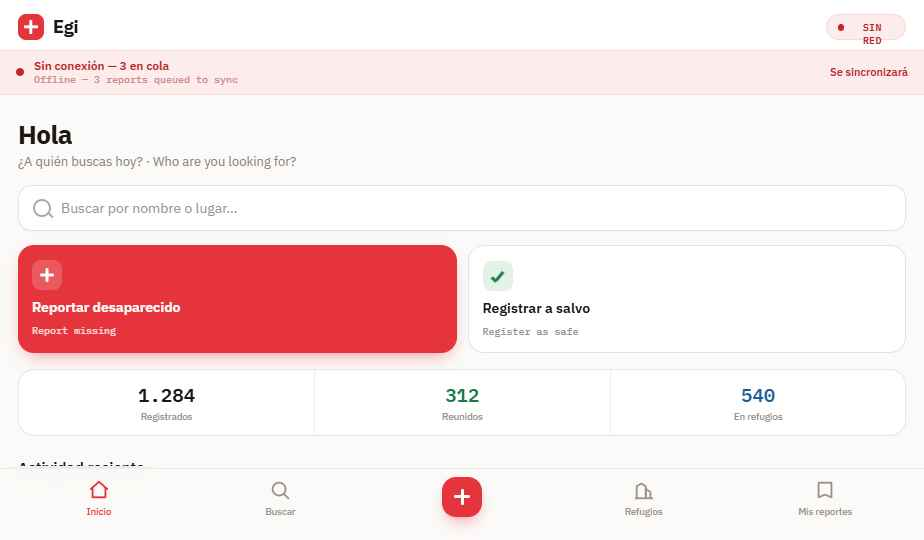
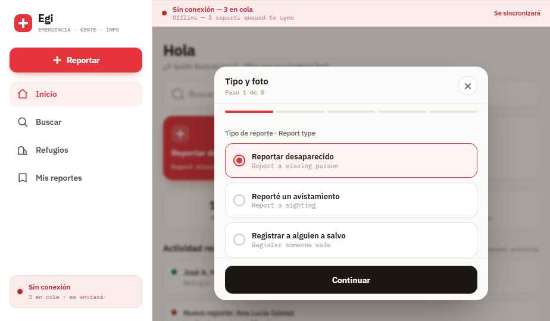

<div align="center">

# EGI



**EMERGENCIA · GENTE · INFO**

Sistema aberto, offline-first e auto-hospedável para ajudar famílias a se
reencontrarem depois de um desastre, mesmo quando o acesso à internet é limitado
ou instável.

[Español](../README.md) | [English](README.en.md) | Português | Mais idiomas bem-vindos

<br>


[Recursos](#-recursos) · [Início rápido](#-início-rápido) · [Capturas](#-capturas) · [Arquitetura](#-arquitetura) · [Roteiro](#-roteiro) · [Docs](#-documentação) · [Contribuir](#-contribuir)

</div>

---

## 💡 Por Que O EGI Existe

Depois de um desastre, as pessoas precisam de respostas rapidamente:

> Meu familiar está em segurança?  
> Onde ele foi visto pela última vez?  
> Alguém já fez um registro?  
> A informação ainda consegue circular se a internet cair?

Em muitas emergências, as pessoas acabam usando grupos de WhatsApp, capturas de
tela, reposts, listas em papel e planilhas. Essas ferramentas ajudam, mas são
difíceis de pesquisar, fáceis de duplicar e complicadas de manter atualizadas.

**EGI** existe para tornar informações de emergência sobre pessoas mais fáceis
de registrar, buscar, sincronizar, traduzir e auto-hospedar.

O nome significa:

**Emergencia**: criado para situações de crise  
**Gente**: centrado em pessoas, famílias e comunidades  
**Info**: focado em informação útil e pesquisável

Este projeto nasceu de um contexto venezuelano, mas foi pensado para qualquer
comunidade que precise de um sistema leve de reunificação familiar.

---

## 📸 Capturas

> Capturas de protótipo/demo. As informações mostradas nas imagens devem ser tratadas como fictícias, salvo indicação em contrário.

<details open>
<summary><strong>Início no celular</strong>: painel de emergência, busca de pessoas, ações de registro e estado offline</summary>


</details>

<details>
<summary><strong>Modal no desktop</strong>: fluxo em tela maior para ver ou editar informações de emergência</summary>



</details>

---

## 🎯 Recursos

### 🧭 Registro De Emergência

**Registros de pessoas**: registre alguém como `missing`, `found`, `safe` ou `deceased`

**Busca local**: pesquise por nome, status, localização, notas ou outras palavras-chave

**Contexto por evento**: pensado para um desastre ou emergência específica, não como uma base de dados genérica

**Hospedagem comunitária**: qualquer grupo pode implantar seu próprio servidor e gerenciar seus próprios dados

### 📡 Offline First

**Armazenamento local**: o app web salva os registros primeiro no dispositivo

**Progressive Web App**: funciona pelo navegador e pode ser instalado em celulares compatíveis

**Sincronização ao voltar a internet**: os registros podem sincronizar com o servidor quando houver conexão

**Design para baixa conectividade**: pensado para celulares, dados instáveis e condições de crise

### 🔵 Visão Bluetooth Mesh

**Android primeiro**: o futuro app nativo terá foco em Android porque a plataforma oferece melhor acesso a Bluetooth

**Bluetooth Low Energy**: sincronização peer-to-peer planejada entre celulares próximos

**Armazenar e encaminhar**: celulares podem trocar registros offline e enviar depois quando algum tiver internet

**Rascunho do protocolo**: veja [`mobile/shared/protocol.md`](../mobile/shared/protocol.md)

### 🌎 Idiomas

**Espanhol primeiro**: o projeto nasceu a partir de uma emergência venezuelana

**Inglês como segundo idioma**: útil para contribuidores, operadores e equipes internacionais

**Mais idiomas são bem-vindos**: português, línguas indígenas e traduções de comunidades locais

**Linguagem clara**: software de emergência deve ser compreensível sem conhecimento técnico

### 🔒 Segurança E Privacidade

**Sem anúncios nem rastreamento**: este projeto não deve monetizar dados de crise

**Coleta mínima de dados**: peça apenas informações úteis para reunificação e resposta

**Pronto para moderação**: implantações públicas devem revisar registros falsos, prejudiciais, duplicados ou abusivos

**Cuidado com dados sensíveis**: fotos, telefones, documentos, números de identidade e endereços exatos exigem atenção especial

---

## 🚀 Início Rápido

### App Web

O backend serve o frontend automaticamente. Com o servidor rodando em
`http://localhost:3000`, abra:

```text
http://localhost:3000
```

Para desenvolvimento apenas da UI, você também pode servir `frontend/` separadamente:

```bash
cd frontend
python -m http.server 8081
```

### Servidor

Execute a API de sincronização com Python, FastAPI e SQLite:

```bash
cd server
python -m venv .venv
.venv\Scripts\activate  # Windows
# source .venv/bin/activate  # macOS/Linux
pip install -r requirements.txt
cp .env.example .env
python -m db
uvicorn main:app --host 127.0.0.1 --port 3000 --reload
```

URL padrão (frontend + API):

```text
http://localhost:3000
```

Para usar um servidor implantado, configure a URL da API no navegador:

```js
localStorage.setItem('egi_api_url', 'https://seu-servidor.example.com');
```

### Android

O app Android está planejado e parcialmente estruturado. Veja
[`mobile/android/README.md`](../mobile/android/README.md) para a direção atual.

---

## 🏗️ Arquitetura

```text
                              INTERNET DISPONÍVEL
                                     │
                                     ▼
┌──────────────────────┐      ┌──────────────────────┐
│      Web / PWA       │      │      App Android      │
│ Armazenamento local  │      │  Base local móvel     │
└──────────┬───────────┘      └──────────┬───────────┘
           │                             │
           │ HTTPS /sync                 │ Sync por Bluetooth LE
           │                             │ (planejado)
           ▼                             ▼
┌─────────────────────────────────────────────────────┐
│                    Servidor EGI                     │
│              Node.js + Express + SQLite             │
│                                                     │
│  GET /persons       buscar registros                │
│  GET /persons/:id   obter um registro               │
│  POST /sync         enviar registros modificados    │
│  GET /sync          baixar registros modificados    │
└─────────────────────────────────────────────────────┘
```

O app web e o futuro app Android devem manter dados localmente primeiro. O
servidor funciona como centro de sincronização, não como o único lugar onde os
registros podem existir.

---

## 🗺️ Roteiro

- [x] Protótipo web offline-first
- [x] Armazenamento local no navegador com IndexedDB
- [x] Registro e busca básica de pessoas
- [x] Servidor de sincronização com Node.js + SQLite
- [x] Arquivos públicos de contribuição e conduta
- [x] Pasta Android e rascunho do protocolo Bluetooth
- [ ] Estrutura multilíngue para a interface
- [ ] Textos do app em espanhol e inglês
- [ ] Importação e exportação de registros locais
- [ ] Suporte a fotos com controles cuidadosos de privacidade
- [ ] Detecção de duplicados e fluxo de mesclagem
- [ ] Fila de moderação para implantações públicas
- [ ] Wrapper Android WebView
- [ ] Banco de dados local nativo no Android
- [ ] Descoberta e conexão por Bluetooth LE
- [ ] Troca de registros por Bluetooth
- [ ] Guia de implantação para VPS e servidores comunitários
- [ ] Revisão de segurança e privacidade
- [ ] Revisão de acessibilidade

---

## 📖 Documentação

| Documento | Descrição |
|-----------|-----------|
| [`README.md`](../README.md) | README em espanhol |
| [`docs/README.en.md`](README.en.md) | README em inglês |
| [`frontend/README.md`](../frontend/README.md) | Configuração, implantação e TODOs do app web |
| [`server/README.md`](../server/README.md) | Endpoints da API e configuração do servidor |
| [`mobile/android/README.md`](../mobile/android/README.md) | Direção do app Android e notas sobre Bluetooth |
| [`mobile/shared/protocol.md`](../mobile/shared/protocol.md) | Rascunho do protocolo Bluetooth mesh |
| [`CONTRIBUTING.md`](../CONTRIBUTING.md) | Como contribuir |
| [`CODE_OF_CONDUCT.md`](../CODE_OF_CONDUCT.md) | Expectativas da comunidade |
| [`LICENSE`](../LICENSE) | Licença MIT |

---

## 🧱 Stack Técnico

| Camada | Tecnologia |
|--------|------------|
| App web | HTML, CSS, JavaScript, Service Worker |
| Armazenamento web local | IndexedDB |
| Servidor | Python, FastAPI |
| Banco de dados | SQLite |
| OCR / IA | Tesseract + Prompture |
| Mobile | Android planejado, direção Kotlin |
| Mesh offline | Bluetooth Low Energy planejado |
| Implantação | Backend único serve web + API, VPS ou servidor pequeno |

---

## 🔒 Princípios De Privacidade

EGI pode lidar com informações pessoais sensíveis. Trate-as com cuidado.

- Coletar apenas a informação mínima e útil.
- Usar HTTPS em implantações públicas.
- Fazer backup seguro do banco de dados.
- Evitar publicar telefones, documentos, endereços exatos ou fotos desnecessárias.
- Marcar claramente registros não verificados.
- Preferir correções e histórico em vez de apagar dados silenciosamente.
- Não adicionar analytics, publicidade nem pixels de rastreamento.
- Remover rapidamente conteúdo prejudicial, falso, abusivo ou exploratório.

EGI é uma ferramenta de coordenação comunitária. Não substitui serviços de
emergência, abrigos, hospitais, equipes locais nem organizações humanitárias
confiáveis.

---

## 🤝 Contribuir

Contribuições são bem-vindas. Leia [`CONTRIBUTING.md`](../CONTRIBUTING.md)
antes de abrir um pull request.

```text
fork -> branch de feature -> commit -> push -> pull request
```

Áreas prioritárias:

- Sincronização Android por Bluetooth Low Energy
- Melhorias na PWA offline-first
- Traduções em espanhol, inglês e português
- Acessibilidade e UX com linguagem clara
- Revisão de segurança e privacidade
- Documentação de implantação
- Detecção de duplicados e fluxos de moderação
- Testes reais em ambientes com baixa conectividade

Pequenas contribuições importam. Se encontrar um bug, abra uma issue. Se puder
corrigir, abra um pull request.

---

## ⚠️ Aviso

EGI é um projeto comunitário open-source, não um serviço oficial do governo nem
uma autoridade de emergência. As informações registradas podem estar
incompletas, duplicadas, desatualizadas ou não verificadas.

Em uma emergência, siga as instruções oficiais de segurança quando disponíveis e
entre em contato com serviços de emergência, abrigos, hospitais ou organizações
humanitárias confiáveis.

---

<div align="center">

**EGI**: Emergencia · Gente · Info

Feito pela Venezuela, e por todo lugar onde uma família tenta encontrar os seus.

</div>
